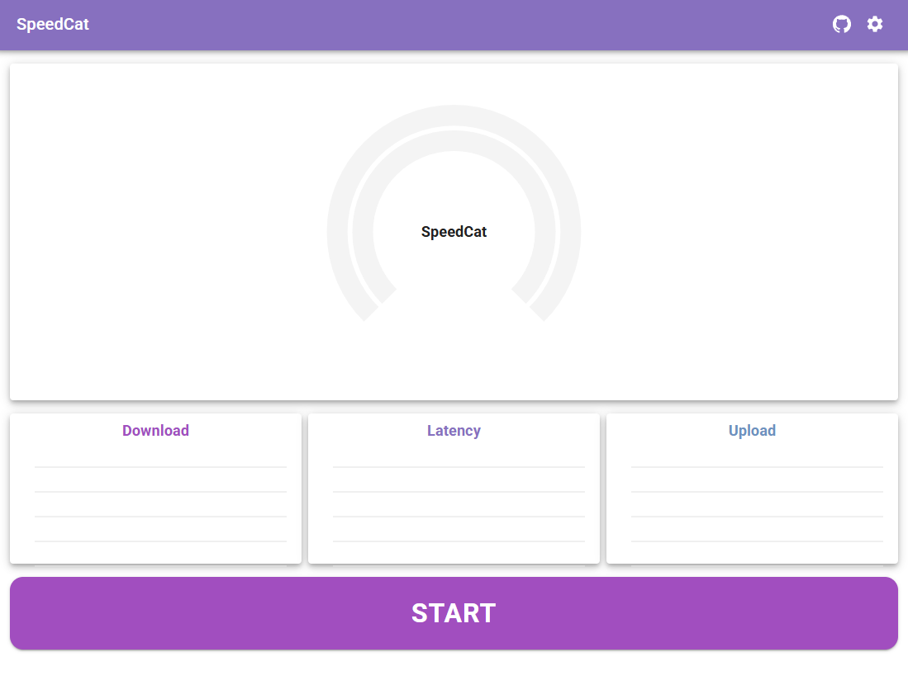
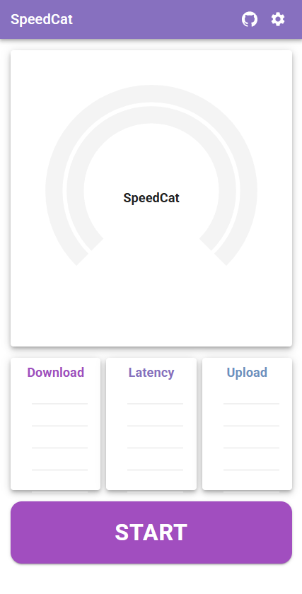

# SpeedCat
###### A free and open-source, self-hosted tool for estimating network performance.  
Built using TypeScript, React, and native web APIs, it is designed to be universally compatible across various desktop and mobile devices, requiring only a web browser for access.  
SpeedCat operates fully client-side, requiring only a web server of your choice to self-host.
All tests are conducted exclusively between the client and the self-hosted server, providing privacy and peace of mind.

A demo is available at [demo.speedc.at](https://demo.speedc.at). Please don't break it, it's a tiny environment.

<table>
  <tr>
    <td>
      
    </td>
    <td>
      
    </td>
  </tr>
</table>

## Setup
### Prebuilt Docker image
Prebuild docker images are available which can be utilized via docker compose.
```yaml
services:
  speedcat:
    image: ghcr.io/horstexplorer/speedcat:<hash>
    container_name: SpeedCat
    restart: unless-stopped
    ports:
      - 8080:8080
```

### Manual
Build the application via npm and deploy it on your own webserver or via self built docker container.
```bash
# Install dependencies
npm install

# Build application
npm run build

# Generate test file payloads (not required for building the docker image in the next step)
./test-file-setup.sh
```
Copy and serve the build output from `dist` to your webserver location or build your local docker image.
```bash
# With docker build
docker build -t selfbuilt-speedcat .

# or buildx
docker buildx build -t selfbuilt-speedcat .
```

## Customization
You can configure the available payload files available to SpeedCat. To do so, adjust the entries in the test-file-index.json.
A minimal configuration as shown below is required.
```json
{
  "testFiles": [
    {
      "path": "test-files/0-mibibytes",
      "byteSize": 0,
      "flags": {
        "default": true
      }
    },
    {
      "path": "test-files/25-mibibytes",
      "byteSize": 26214400,
      "flags": {
        "default": true,
        "selectable": true
      }
    }
  ]
}
```
Entries must always include a valid `path` that points to a directory (using `test-files` is a good choice), along with a filename free of collisions.
These files will be automatically generated with random data based on the specified `byteSize` property.
The `selectable` property allows the option to be selected through the UI, while `default` indicates a pre-selected option.

To ensure correct operations there has to be one file with a `byteSize` of `0` and `default` set to `true`, as well as one file with a `byteSize` greater than `0`, which must also be `selectable` and have `default` set to `true`.
